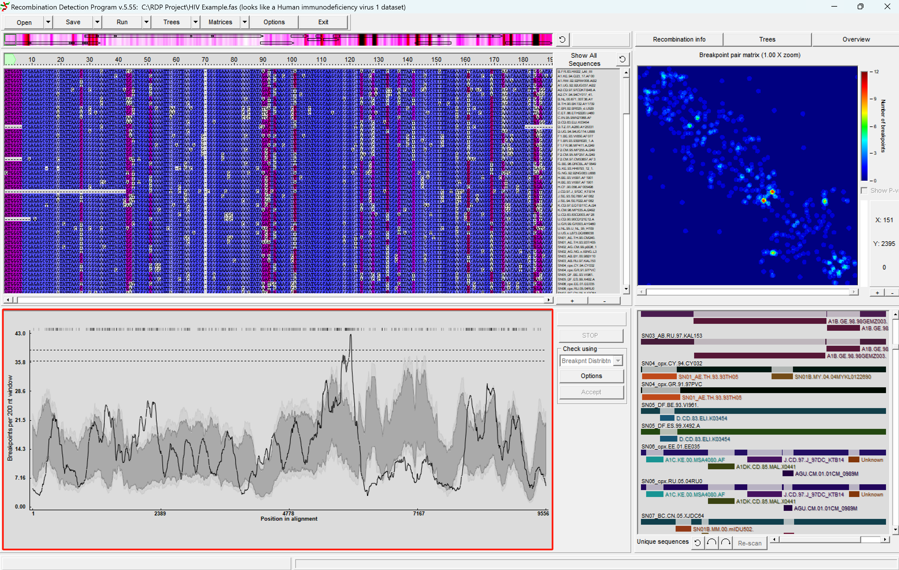
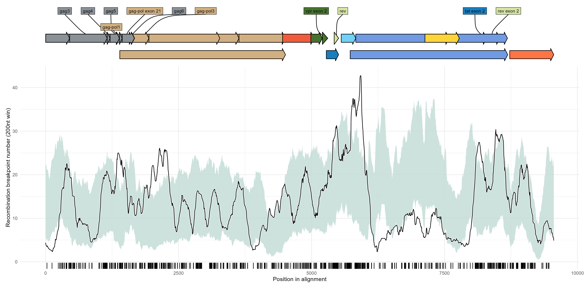
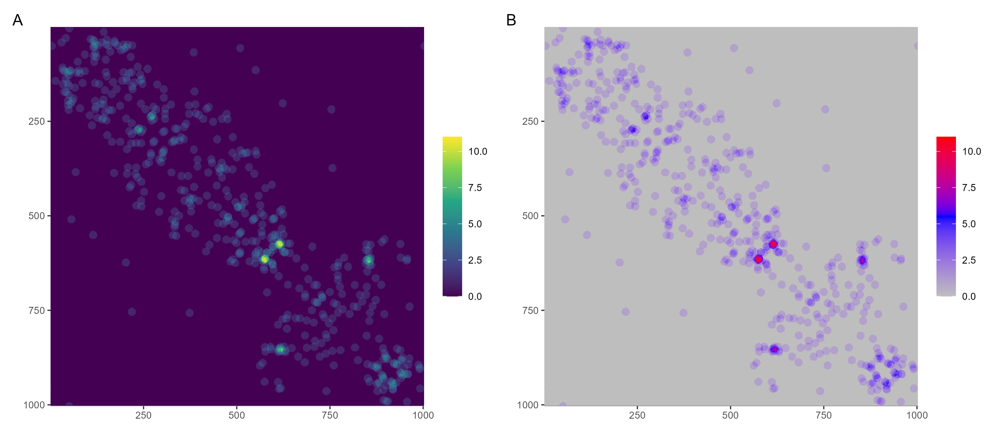

# rdpvis: Visualizing RDP data

This package is designed to parse and visualize data exported by [RDP](https://web.cbio.uct.ac.za/~darren/rdp.html) (currently, only break point plot supported).


## :writing\_hand: Author

Guangchuang YU

School of Basic Medical Sciences, Southern Medical University

<https://yulab-smu.top>

## :arrow\_double\_down: Installation

Get the latest version from github:

``` r
remotes::install_github("YuLab-SMU/rdpvis")
```

## :beginner: Usage




### Break point plot

``` r
library(rdpvis)
f <- system.file("extdata", "demo.csv", package="rdpvis")
x <- read_rdp_breakpoint(f)
autoplot(x)
```



### Break point matrix


``` r
f <- system.file("extdata", "break-point-matrix.csv", package="rdpvis")
x <- read.csv(f, header=FALSE)

p <- mplot(x) 
p2 <- p + scale_fill_gradientn(colors=c("grey", "blue", "red"))
aplot::plot_list(p, p2, tag_levels='A')
```



